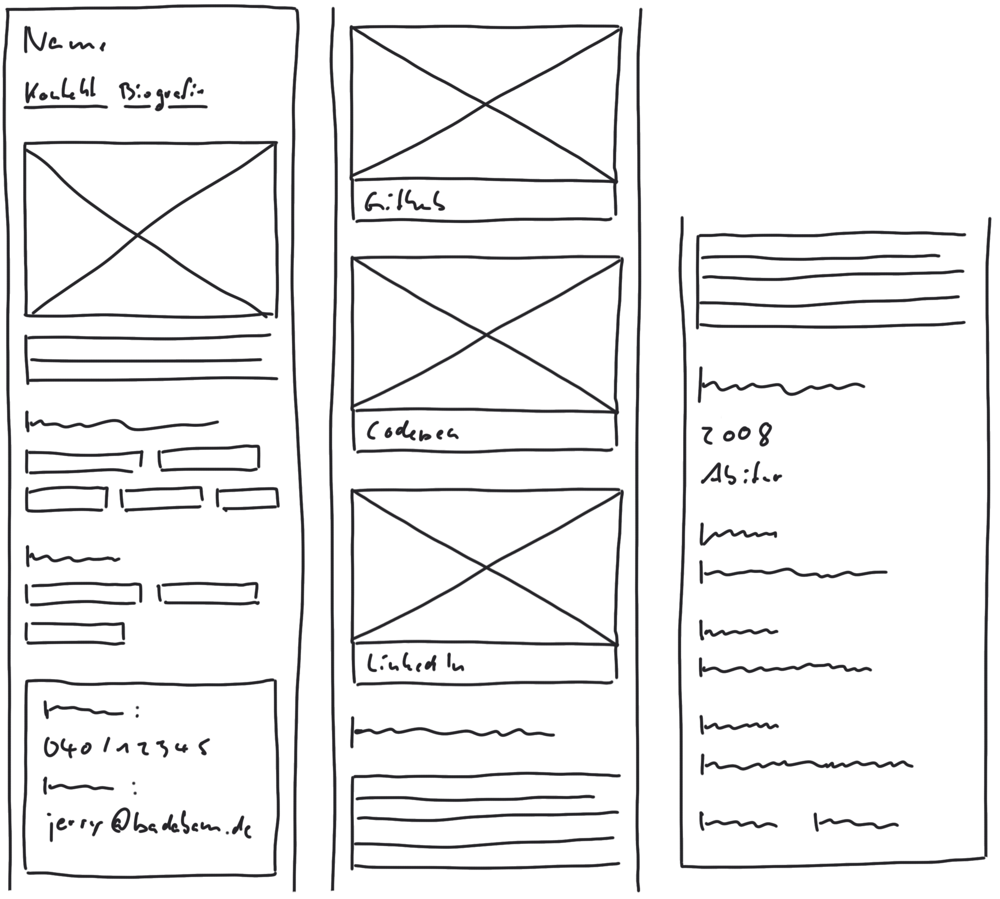
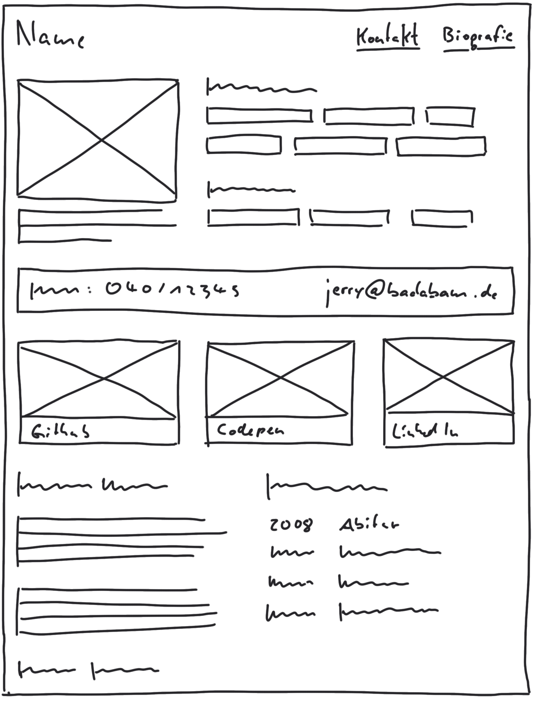

# 2020-01-09, Thursday
Themen (Wiederholung (HTML, Emmet, iTerm, Git) Einführung in Bootstrap, Übung ab Nachmittag: Beginn Html-Bootstrap-Hausaufgabe für Montag 

>`Montag-Wettkampf: Wer als schnellstes eine kleine Seite mit Bootstrap baut gewinnt 30 minütige Code-Review mit Jerry, die beliebig eingelöst werden kann.`

### Ende der Woche: Beginn mit kleiner Portfolio Webseite 
* nur HTML
* SinglePage reicht, man darf aber auch Unterseiten machen
* hübsch mit Bootstrap, kein eigenes CSS
* Responsive, mobile first
* Fr: ganzen Tag, ggf. WE, Mo: Präsi

#### Mobile und Desktop WIreframe zur HA:

### Ergänzung zu Git

`git pull`    
- zieht aktuellen Stand des Masters
- regelmäßig im Laufe des Tages
- bei eigenem Branch zieht man sich regelmäßig Master um frühzeitig Konflikte mit Branch zu erkennen 

## Bootstrap

https://getbootstrap.com

>Tipp: Codepen-Settings anpassen
> - HTML-Reiter in neuen Pen von Codepen
> - _(Jerrys Codepen-Link: `https://codepen.io/badabam/pen/PowRpjG?editors=1000`, `Fork` für eigne Version)_

### Emmet inAuf Codepen verwenden

Emmet-Befehl (+ Tab) | HTML
--- | --- 
`button.btn` | `<button class="btn">...</button>`
`button.btn-primary` | `<button class="btn-primary">...</button>`
`main.container` | `<main class="contaioner bg-secondary">...</main>`
`main.container bg-light` | `<main class="contaioner bg-light text- `**light** ` ">...</main>`
`-"- dark` | `<main class=" `&nbsp; &nbsp; &nbsp;`- " -` &nbsp; &nbsp; &nbsp; &nbsp; &nbsp; &nbsp; &nbsp; &nbsp;**dark** `">...</main>`
`.row` | `
 ... 
`
---
> - Hintergrundfarbe geht immer bis zur Paddingkante.
> - Wenn man sich bei Abständen zwischen ELemneten zwischen padding und margin entscheiden muss, wähle margin, das ist dafür gedacht.
---

Emmet-Befehl (+ Tab) | HTML
--- | --- 
`class="row mb-3" ` | margin-botton 3px

> Git-Tipp: Name von repository = github-Name => erzeugt praktische Portfolio-URL auf git: leene.github.io/

> ALs Anfänger HTML-Seiten von oben nach unten bauen

> inerhalb collumn ist weitere Verschachtelung mit row wieder erlaubt

kursiv | Code | fett
--- | --- | ---
*Still* | `renders` | **nicely**

