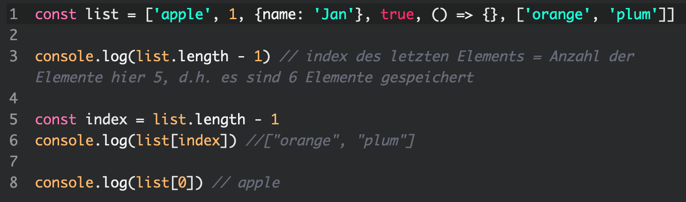
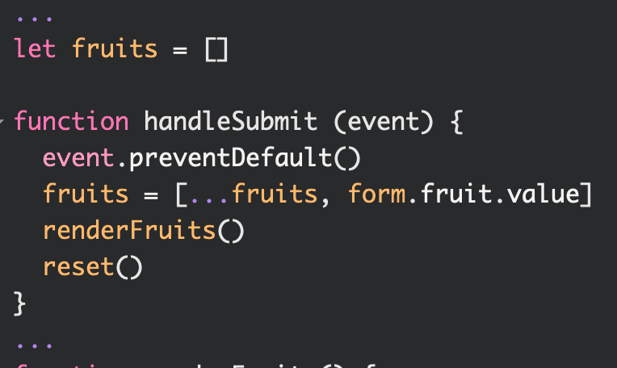
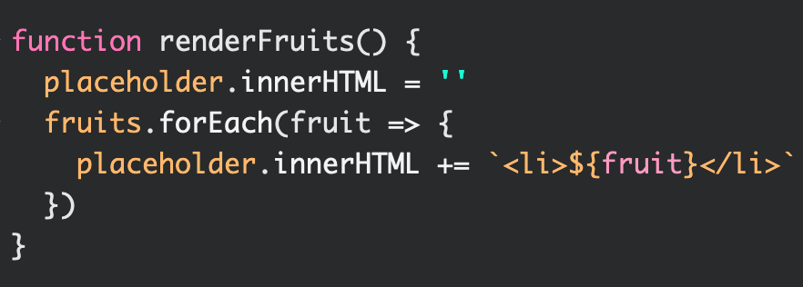
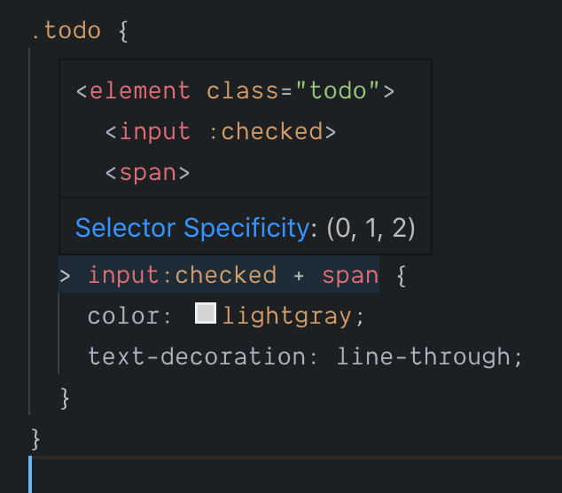
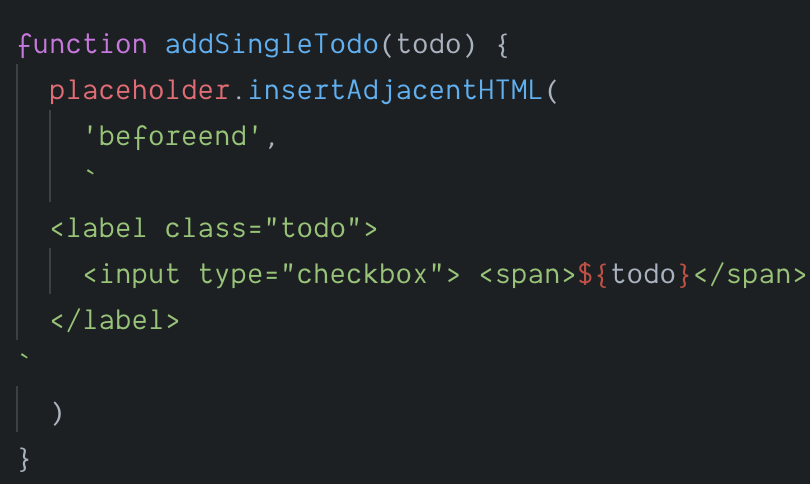
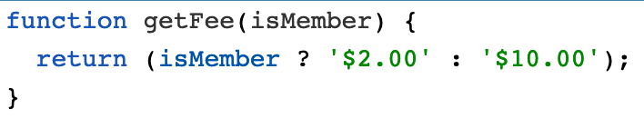

_(Themen: )_

# 22.01.2020 Mittwoch
### Besprechung der Hausaufgabe
Lösung: https://codepen.io/badabam/pen/yLyrRZW?editors=0010#

*(zwei Themen im Wechsel: neues HTML direkt als Elemente erzeugen und Arrays)*

## 1. Weiteres zu Arrays und der Spread-Operator (siehe 2. Eintrag Tabelle)

Beispiel: 
Array intro: https://codepen.io/badabam/pen/RwNOemj?editors=0010

- Arrays sind Speicherbehälter, die Daten geordnet abspeichern
- geordnet heißt: die einzelnen Daten sind in bestimmter Reihenfolge im Array abgelegt
- Reihenfolge entspricht entweder: 
  1. der Reihenfolge der Befüllung, 
  1. oder des Speicherns (wenn einzelne Datensätze angehängt wurden) 
  1. oder die Reihenfolge wurde bewusst über den Index bestimmt
- Arrays ordnen den Daten automatisch einen Indexwert zu (beginnt ab 0)

>In EINEM Array können Daten unterschiedlicher Typen (Strings, boolsche Werte, Zahlen, andere Arrays, Objekte) abgespeichert werden

---- 

code | Bemerkung
--- | ---
`list.push('banana')` | mit push kann man neue Daten in Array einfügen
`list = [...list, 'banana']` | `**spread operator:**`  "..." (drei Punkte) besagen, dass man die alten Inhalte einfügt (zusätzlich kommt hier `banana` dazu)
`event.preventDefault()` | verhindert bei `form`/`anker`- Elementen das Formular abgeschickt oder der Ankersprung ausgelöst wird`
 `<input name="fruit" ... >` | `name`-Attribute von `input`-Elementen helfen die Daten mit einem Namen zu versehen oder im Formular darauf zuzugreifen

----

### Letztes Element raussuchen (Siehe Zeile 5)

----

> - Um neues Array zu erzeugen, muss Array statt mit `const` mit `let` initialisiert werden
> - `form`-Tag löst per default das Senden von Formulardaten aus, was man  mit `event.preventDefault()` verhindern kann: 

*(gesamtes Bsp: https://codepen.io/badabam/pen/RwNOemj?editors=0011)*

https://codepen.io/badabam/pen/RwNOemj?editors=1111

https://codepen.io/badabam/pen/RwNOemj?editors=1011

## 2. Hinzufügen von Elementen mit Property `innerHTML`: 

*(gesamtes Bsp: https://codepen.io/badabam/pen/RwNOemj?editors=0010 )*

----
## 3. Übung "toDo App" zu zweit

Aufgabe: neue App mit input und button unten, in codesandbox erstellen
- *Jerrys Lösung: https://codesandbox.io/s/wonderful-surf-fmq1q*

> Prettier in codesandbox aktivieren: "Configuration Files" > Prettierrc > 
> - Semicolons: off
> - Use Single Quote: off
> - Trailning Commas: es5

----

Tipps
Thema | Beschreibung
---|---
JS Kurzschreibe   | `name:name` => `name` (wenn key genauso heißt wie value)
JS > HTML| `form` feuert submit-Event ab, also nur dort sollte man da auf Submit lauschen
 CSS > "+" | = Siblingselector; spricht das Element direkt dahinter an 
 
 ## 4. insertAdjacentHTML
 

> statt `beforeend` gibt es noch `beforebegin`, `afterbegin`, `afterend`

Bsp: (https://codesandbox.io/s/wonderful-surf-fmq1q): 

´´´
...
function addSingleTodo(todo) {
  placeholder.insertAdjacentHTML(
    'beforeend',
    `
  <label class="todo">
    <input type="checkbox"> ${todo}
  </label>
`
  )
}

## 5. localStorage: Über Browsersitzung hinaus Daten speichern (im Array) 

- jede App kann 5 MB Daten im Browser speichern, solange man Cache nicht löscht
- ist kein Cookie (diese beziehen sich auf Browserkommunikation)

https://codesandbox.io/s/advanced-todo-app-oxypo

https://codepen.io/badabam/pen/abzxxEa

> Speicherfunktionalität in Function ausgelagert: 
https://codepen.io/badabam/pen/abzxxEa?editors=1010

## 6. logische Operatoren

Operator | Beschreibung
---|---
`===` | ist kein Gleichheitszeichen, sondern ein Vergleich 
`&&` | Logisches UND
`||` | Logisches ODER
truthy | Wert wird als truthy angesehen solange er nicht: `false`, `0`, `""`, `null`, `undefined` oder `NaN` ist (leeres array ist immer truthy)
falsy | Wert welcher zu `false` übersetzt, wenn er in einem booleschen Kontext ausgewertet wird
Bedingung ? Ausdruck1: Ausdruck2 |  Bedingter (ternäre) Operator (ternery operator), einziger Operator mit drei Operanden; wird oft als Kurzform eines if-Statements genutzt 
Beispiel ternärer Operator: 
 
 

